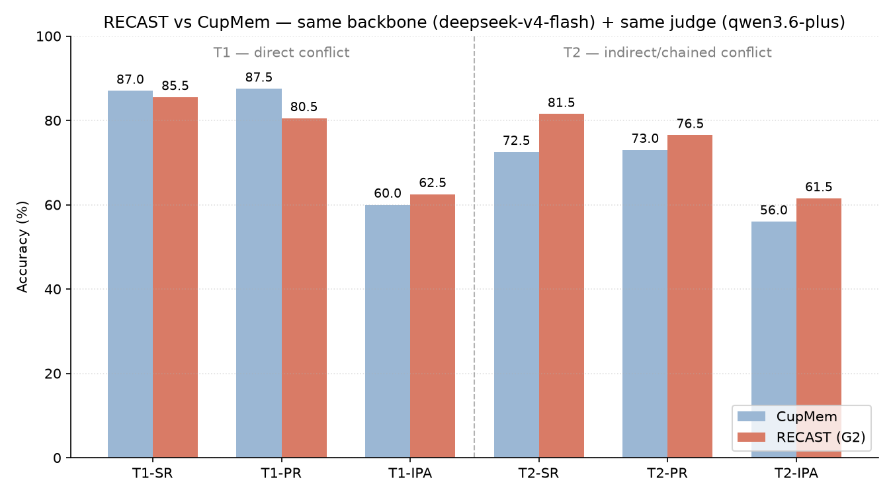

# RECAST: Retroactive Evidence-based Conflict-Aware State Tracking

**[中文版](README_CN.md)**

RECAST is a schema-free memory system for LLM agents that automatically detects when stored beliefs become stale. Unlike systems that require a predefined slot schema or explicit user corrections, RECAST applies *abductive inference* to reason backward from new statements and identify which existing memories they implicitly contradict — including indirect, multi-hop contradictions.

---

## The Problem

User memories go stale silently. If a user mentions "I just signed a lease in Toronto" months after an agent stored "lives in San Francisco," most memory systems either keep both facts, apply a recency heuristic, or fail to connect the new statement to the old memory at all. The gap is especially acute for *indirect* conflicts: "I'm starting a pre-dawn bakery shift" doesn't name any location or habit, but it invalidates "evening trivia nights," "streaming subscriptions for late-night viewing," and "available for calls after 9pm" through a chain of temporal implications.

RECAST addresses this through three mechanisms:

1. **Abductive conflict detection**: when a new statement arrives, RECAST generates *impact hypotheses* — what would have had to be true *before* for this statement to represent a change — and tests them against stored memories.
2. **Evidence accumulation**: weak signals that individually fall below the threshold for marking a memory stale are held in a per-memory *evidence pool*. Multiple weak signals from independent sessions compound into a stale verdict.
3. **End-to-end conflict-aware answering**: at query time, RECAST expands retrieval using hypothesis-augmented queries, then applies a 4-step reasoning chain that explicitly identifies outdated assumptions before generating an answer grounded in confirmed facts.

---

## Pipeline

Each conversation session passes through the write phase. At query time, the read phase runs.

```
                         WRITE PHASE
                    ┌──────────────────────────┐
   session turns ──►│ statement_extraction      │  extract user-relevant facts;
                    │                           │  label as current_state / recent_change /
                    │                           │  biographical / lasting_preference
                    ├──────────────────────────┤
                    │ impact_hypothesis         │  generate "what used to be true?" hypotheses
                    │                           │  across 5 dimensions: temporal, physical/
                    │                           │  spatial, economic, enabling context, social;
                    │                           │  cross-references lasting_preference anchors
                    ├──────────────────────────┤
                    │ [embedding retrieval]     │  top-k cosine search for candidates
                    ├──────────────────────────┤
                    │ abductive_judgment        │  for each candidate: direct_invalidation or
                    │                           │  weakens_support, with inference chain
                    ├──────────────────────────┤
                    │ pool_synthesis            │  synthesize accumulated evidence per memory;
                    │                           │  strong (≥0.75) → immediate stale;
                    │                           │  weak (0.35–0.75) → pool → compound signal
                    ├──────────────────────────┤
                    │ impression_update         │  rewrite compressed global profile summary
                    │                           │  ([WHO][STATUS][CHANGES][HABITS], ≤1000 chars)
                    └──────────────────────────┘

                          READ PHASE
                    ┌──────────────────────────┐
    query ─────────►│ query_hypothesis          │  generate hypothetical memory statements
                    │                           │  from global profile to broaden retrieval
                    ├──────────────────────────┤
                    │ [unified retrieval]       │  top-k across ALL statuses (active +
                    │                           │  uncertain + stale) using query +
                    │                           │  hypotheses as parallel embedding queries
                    ├──────────────────────────┤
                    │ E2E answer generation     │  4-step CoT: extract query assumption →
                    │                           │  check stale memories against assumption →
                    │                           │  surface conflict explicitly →
                    │                           │  answer grounded in confirmed facts only
                    └──────────────────────────┘
```

### Memory item lifecycle

Each fact extracted from a session becomes a `MemoryItem` with three possible statuses:

| Status | Meaning |
|--------|---------|
| `active` | Confirmed true; used for direct retrieval and answering |
| `uncertain` | Weakened by weak-signal evidence but not yet definitively stale |
| `stale` | Superseded; carries `stale_metadata` with reason and session timestamp |

Memory items are tagged with a semantic **category** (`current_state`, `recent_change`, `biographical`, `lasting_preference`) that governs retrieval priority and evidence compounding rules.

### Evidence pool

When abductive judgment returns a weak signal (confidence 0.35–0.75), the evidence is appended to the target item's `evidence_pool` rather than immediately marking the item stale. At each new weak signal, `pool_synthesis` re-evaluates the full pool:

- Multiple weak signals from *different sessions* addressing *different aspects* compound.
- Signals from the same session and same logical chain count as one.
- Synthesized confidence ≥ 0.75 triggers stale; ≥ 0.5 triggers uncertain.

This design prevents a single ambiguous statement from triggering premature staleness while ensuring that consistent evidence across sessions accumulates to a verdict.

---

## Evaluation

Evaluated on the [STALE](https://github.com/STALEproj/STALE) benchmark, which tests whether a memory system correctly handles temporal conflicts in user profiles. STALE defines two conflict types and three evaluation dimensions:

| | Description |
|---|---|
| **T1** | Direct conflict: new fact directly contradicts a stored memory |
| **T2** | Indirect chained conflict: new fact implies contradiction through multi-hop reasoning |
| **SR** (dim1) | Stale Recall — does the system recognize the old memory is outdated? |
| **PR** (dim2) | Probe Resistance — does the system resist questions that presuppose the stale memory? |
| **IPA** (dim3) | Instructed Plan Adherence — does the system act on the current state, not the stale one? |

Scoring uses `qwen3.6-plus` as an independent judge. Both CupMem and RECAST are scored with the exact same judge system prompt (`SYSTEM_PROMPT_ALL_IN_ONE_JUDGE` in [`STALE/STALE/Evaluation/judge_prompts.py`](STALE/STALE/Evaluation/judge_prompts.py)) — `--model-method` only labels the row in the output, it never switches the prompt. This guarantees the two systems are held to an identical rubric.

**dim2 (Probe Resistance) judge rule:** score true if the response detects the trap or acknowledges the new state, *even if* it also offers a fallback suggestion after correcting the premise; score false only if it blindly agrees with the false premise without any recognition that the underlying situation changed. This is deliberately lenient toward "correct + still helpful" responses: in a real deployment, a user asking a question that presupposes a stale fact is not necessarily probing the system adversarially — they may genuinely be in a new situation they haven't mentioned yet, or simply unaware their stored state has changed. A response that flags the discrepancy and then still tries to help (e.g., "this contradicts X, but here's relevant info either way") is the behavior we want, not a penalized one. Only a response that takes the false premise at face value with no acknowledgment of the conflict should fail dim2.

### Results

**Current default judge: strict** (reasoning chain must explicitly cite M\_new). The lenient-judge tables below are kept for reference; the strict scoring section further down is the primary basis for all paper claims.

The apples-to-apples comparison is CupMem (re-run, non-thinking mode) vs. RECAST (current default config, dispatch-fixed, per-session pool synthesis) — same backbone (deepseek-v4-flash), same judge (qwen3.6-plus). The original paper's own CupMem numbers are included for reference but used a different backbone (o4-mini) and judge (Gemini 3.1), so they are *not* directly comparable to the other two rows. Earlier per-commit RECAST iterations, an old buggy-dispatch baseline, judge-prompt calibration checks, and the full debugging trail behind some of the findings below have been moved to [`EXPERIMENT_LOG.md`](EXPERIMENT_LOG.md) to keep this file results-focused.

| System | T1 n | T2 n | T1-SR | T1-PR | T1-IPA | **T1** | T2-SR | T2-PR | T2-IPA | **T2** | **Overall** |
|--------|------|------|-------|-------|--------|--------|-------|-------|--------|--------|-------------|
| CupMem — paper† | 200 | 200 | 91% | 78% | 32% | 67% | 75% | 66% | 43% | 61% | 64% |
| **CupMem — non-thinking†** | **200** | **200** | **87.0%** | **87.5%** | **60.0%** | **78.2%** | **72.5%** | **73.0%** | **56.0%** | **67.2%** | **72.7%** |
| **RECAST (dispatch-fixed, default)** | **200** | **200** | **88.5%** | **81.0%** | **62.5%** | **77.3%** | **81.5%** | **74.0%** | **61.5%** | **72.3%** | **74.8%** |

† CupMem — paper: original paper / authors' evaluation, same STALE sample set as this repo's runs, but a different backbone (o4-mini) and judge (Gemini 3.1) — not apples-to-apples with the other rows in this table.



**Under strict scoring (current default), RECAST leads on both conflict types.** T1: 63.7% vs CupMem 58.5% (+5.2pp). T2: 54.8% vs CupMem 47.3% (+7.5pp). Overall: 59.3% vs 52.9% (+6.4pp). Under the lenient rubric (table above): T1 RECAST 77.3% vs CupMem 78.2% (-0.9pp), T2 72.3% vs 67.2% (+5.1pp), overall 74.8% vs 72.7% (+2.1pp). The strict-judge gap is wider because strict scoring requires an explicit reasoning chain citing the new evidence. CupMem already uses a conflict-aware answer composer, so this comparison is mostly about upstream detection/grounding plus final answer traceability, not merely whether the final prompt asks for explanations.

### Comparison with established memory systems

All systems use the same backbone (deepseek-v4-flash, --no-thinking) and judge (qwen3.6-plus). Backbone, backbone API, and judge are identical across rows. **All rows now use strict judge** (reasoning chain must explicitly cite M\_new).

| System | T1-SR | T1-PR | T1-IPA | **T1** | T2-SR | T2-PR | T2-IPA | **T2** | **Overall** |
|--------|-------|-------|--------|--------|-------|-------|--------|--------|-------------|
| **RECAST (dispatch-fixed, default) — strict** | **72.0%** | **64.0%** | **55.0%** | **63.7%** | **62.0%** | **52.5%** | **50.0%** | **54.8%** | **59.3%** |
| CupMem — non-thinking (strict) | 67.5% | 61.5% | 46.5% | 58.5% | 48.5% | 51.0% | 42.5% | 47.3% | 52.9% |
| A-MEM v0.2.6 (strict) | 0.5% | 7.0% | 24.0% | 10.5% | 1.5% | 4.5% | 15.5% | 7.2% | 8.8% |
| Naive-RAG (embed + cosine top-10, strict) | 5.0% | 3.5% | 35.5% | 14.7% | 2.5% | 0.5% | 21.0% | 8.0% | 11.3% |
| mem-0 v0.1.100 (strict) | 0.5% | 1.0% | 5.5% | 2.3% | 0.5% | 0.0% | 0.5% | 0.3% | 1.3% |

For reference, lenient-judge baselines (directional correctness only, no M\_new citation required):

| System | T1-SR | T1-PR | T1-IPA | **T1** | T2-SR | T2-PR | T2-IPA | **T2** | **Overall** |
|--------|-------|-------|--------|--------|-------|-------|--------|--------|-------------|
| A-MEM v0.2.6 (lenient) | 94.5% | 33.5% | 37.5% | 55.2% | 94.5% | 27.5% | 34.5% | 52.2% | 53.7% |
| Naive-RAG (lenient) | 58.0% | 6.5% | 51.5% | 38.7% | 47.5% | 4.0% | 33.0% | 28.2% | 33.5% |
| mem-0 v0.1.100 (lenient) | 81.0% | 27.0% | 16.5% | 41.5% | 80.0% | 19.0% | 20.0% | 39.7% | 40.6% |

**What the numbers reveal:**

- **Strict SR (dim1) exposes an attribution/format gap.** Under strict scoring, A-MEM drops from 94.5% (lenient SR) to 0.5%, mem-0 from 81.0% to 0.5%, and Naive-RAG from 58.0% to 5.0%. Existing audit cases show that many A-MEM dim1 failures are directionally correct but terse responses such as "No."; the strict judge then fails them because no reasoning chain is traceable to M\_new. Therefore these near-zero strict SR values should be interpreted as failure to produce traceable M\_new-grounded answers under the current prompt, not as proof that the model never retrieved or stored the new fact.

- **PR (dim2) is the sharpest discriminator under strict scoring.** Naive-RAG reaches only 3.5% strict PR (lenient: 6.5%, nearly the same), A-MEM 7.0% (lenient: 33.5%), and RECAST 64.0%. This dimension is less explained by one-word answers: the system must detect the false premise and avoid answering under it. RECAST and CupMem both include explicit premise-correction answer logic; the weaker baselines use retrieval plus a generic concise answer prompt.

- **IPA (dim3) is non-monotone under both rubrics.** Naive-RAG achieves 35.5% strict T1-IPA vs A-MEM's 24.0% and mem-0's 5.5%, despite lower SR. Naive-RAG's top-1 cosine retrieval sometimes surfaces the most recent session containing M\_new content, leading the LLM to ground recommendations in M\_new by accident. mem-0 stores conflicting memories without resolving which is current; mixed signals push the LLM toward hedged or incorrect plans.

- **T2 gap is larger than T1 under strict scoring.** Indirect conflicts (multi-hop) stress every system more. Under strict scoring, RECAST reaches 54.8% T2 vs mem-0 0.3% / A-MEM 7.2% / Naive-RAG 8.0%. Abductive hypothesis generation across temporal/social/spatial dimensions is the mechanism intended to bridge T2; for the weaker baselines, the observed low score combines missing indirect-conflict machinery with the lack of an attribution-aware answer prompt.

- **Lenient SR is not enough for traceable staleness awareness.** The large lenient/strict gap for A-MEM (SR: 94.5% -> 0.5%) and mem-0 (SR: 81.0% -> 0.5%) shows that directional correctness can coexist with missing explicit grounding. A fair-attribution diagnostic rerun confirms the caveat: Naive-RAG improves on the same 60 UIDs when prompted to expose retrieved evidence (T1 16.7% -> 37.8%, T2 1.1% -> 18.9%), but the gap remains large; mem0 does not improve in a 10-sample pilot. Therefore the strict baseline rows should be read as a mix of answer-attribution sensitivity and upstream retrieval/state-selection failures, not as pure memory-capability evidence.

### Ablation overview — what each one removes/replaces/keeps per pipeline stage

✅ = real LLM call (fresh) · ❌ = skipped/absent · 🔄 = non-LLM substitute · *reused* = read from G2 trace, zero new cost · — = N/A (stage not reached)

| Ablation | Statement extraction | Hyp gen (write) | Impr in (write) | Judgment (abdu) | Pool synthesis | Impr update | Query hyp (read) | Impr in (read) | Retrieval | Final answer |
|---|---|---|---|---|---|---|---|---|---|---|
| Ablation E | fresh | ❌ | — | ✅ | ✅ | ✅ | ✅ | ✅ | ✅ | ✅ |
| Ablation D | fresh | ✅ | ✅ | 🔄 embedding (top-8 retrieved candidates, calibrated) | ✅ | ✅ | ✅ | ✅ | ✅ | ✅ |
| A-PoolReset | reused | reused | reused | reused | ✅ (per-session, cleared after each decision) | ✅ | ✅ | ✅ | ✅ | ✅ |
| A-NoPool | reused | reused | reused | reused | ❌ (immediate single-judgment decision) | ✅ | ✅ | ✅ | ✅ | ✅ |
| A-NoImp* | reused | reused | — | reused | ✅ | ❌ | ✅ | ❌ | ✅ | ✅ |
| Ablation C | fresh | ✅ | ❌ | ✅ | ✅ | ❌ | ✅ | ❌ | ✅ | ✅ |
| A-NaiveAnswer | reused (final snapshot) | reused | reused | reused | reused | reused | ✅ | ✅ | ✅ | 🔄 naive prompt, same inputs |
| Ablation F (no query hyp) | reused (final snapshot) | reused | reused | reused | reused | reused | ❌ | ✅ | ✅ | ✅ |
| (f) dispatch-fix replay | reused | reused | reused | reused | snapshot before bug session / ✅ from bug session on | same as pool | ✅ | ✅ | ✅ | ✅ |

\* A-NoImp's hypothesis gen is *reused* from the baseline trace (never re-run); and because `--no-impression` is set, impression would have been empty even if it had run — so this ablation only tests impression's *read-side* effect (Impr in (read) = ❌). See the dedicated caveat further down.

### All systems under the lenient dim2 judge (for reference)

| System | T1-SR | T1-PR | T1-IPA | **T1** | T2-SR | T2-PR | T2-IPA | **T2** |
|---|---|---|---|---|---|---|---|---|
| CupMem — non-thinking | 87.0% | 87.5% | 60.0% | 78.2% | 72.5% | 73.0% | 56.0% | 67.2% |
| **RECAST (dispatch-fixed, current default) †** | **88.5%** | **81.0%** | **62.5%** | **77.3%** | **81.5%** | **74.0%** | **61.5%** | **72.3%** |
| RECAST — `d215489` old-dispatch baseline (per-evidence, no substitution) | 89.5% | 86.5% | 61.5% | 79.2% | 85.0% | 77.5% | 53.5% | 72.0% |
| RECAST — Ablation E (no hypothesis generation, judgment + impression kept, full fresh write) § | 77.5% | 68.0% | 69.5% | **71.7%** | 57.0% | 43.0% | 52.5% | **50.8%** |
| RECAST — Ablation D (embedding replaces LLM judgment, full fresh write) | 71.8% | 59.5% | 53.5% | **61.6%** | 71.8% | 59.5% | 52.8% | **61.3%** |
| RECAST — A-PoolReset (per-session accumulation, no cross-session carryover) | 87.5% | 73.5% | 60.0% | **73.7%** | 79.5% | 63.0% | 56.0% | **66.2%** |
| RECAST — A-NoPool (no evidence accumulation, immediate single-judgment decision) | 84.5% | 71.0% | 60.0% | **71.8%** | 76.0% | 56.5% | 54.5% | **62.3%** |
| RECAST — A-NoImp (no impression, baseline replay) | 86.5% | 77.0% | 57.0% | **73.5%** | 84.0% | 70.5% | 56.0% | **70.2%** |
| RECAST — Ablation C (full fresh write, no impression_update) | 83.0% | 79.8% | 63.0% | **75.2%** | 82.2% | 80.0% | 62.7% | **75.0%** |
| RECAST — A-NaiveAnswer (no structured CoT in final answer prompt) ‡ | 87.5% | 38.0% | 54.5% | **60.0%** | 79.5% | 28.5% | 57.5% | **55.2%** |
| RECAST — Ablation F (no query hypothesis, G2 final snapshot) ♦ | 89.5% | 84.5% | 67.0% | **80.3%** | 86.0% | 81.0% | 55.5% | **74.2%** |

**Strict scoring — PRIMARY (reasoning chain must explicitly cite M\_new; current default judge)**

| System | T1-SR | T1-PR | T1-IPA | **T1** | T2-SR | T2-PR | T2-IPA | **T2** |
|---|---|---|---|---|---|---|---|---|
| CupMem — non-thinking | 67.5% | 61.5% | 46.5% | **58.5%** | 48.5% | 51.0% | 42.5% | **47.3%** |
| **RECAST (dispatch-fixed, default) †** | **72.0%** | **64.0%** | **55.0%** | **63.7%** | **62.0%** | **52.5%** | **50.0%** | **54.8%** |
| RECAST — `d215489` old-dispatch baseline | 74.5% | 69.0% | 52.5% | **65.3%** | 61.0% | 52.5% | 46.0% | **53.2%** |
| RECAST — Ablation E (no hypothesis generation) § | 74.0% | 63.0% | 65.0% | **67.3%** | 49.5% | 36.5% | 47.5% | **44.5%** |
| RECAST — Ablation D (embedding replaces LLM judgment) | 71.5% | 56.0% | 49.5% | **59.0%** | 48.5% | 30.5% | 42.0% | **40.3%** |
| RECAST — A-PoolReset (per-session accumulation) | 75.0% | 60.0% | 52.0% | **62.3%** | 59.0% | 47.0% | 46.0% | **50.7%** |
| RECAST — A-NoPool (no evidence accumulation) | 73.5% | 60.0% | 54.5% | **62.7%** | 56.0% | 42.0% | 46.0% | **48.0%** |
| RECAST — A-NoImp (no global impression) | 75.5% | 64.0% | 53.0% | **64.2%** | 59.5% | 50.0% | 50.0% | **53.2%** |
| RECAST — Ablation C (no impression_update) | 79.5% | 76.0% | 66.5% | **74.0%** | 53.5% | 50.0% | 48.0% | **50.5%** |
| RECAST — A-NaiveAnswer (no structured CoT) ‡ | 78.5% | 34.5% | 46.5% | **53.2%** | 57.0% | 22.5% | 41.5% | **40.3%** |
| RECAST — Ablation F (no query hypothesis) ♦ | 75.0% | 68.0% | 60.0% | **67.7%** | 57.0% | 53.0% | 47.0% | **52.3%** |
| RECAST — G2 (replay400, deprecated) | 66.0% | 60.0% | 56.0% | **60.7%** | 54.0% | 41.0% | 47.5% | **47.5%** |

**Δ = strict − original (negative = strict rubric harder to pass)**

| System | T1-Avg | T1-SR | T1-PR | T1-IPA | T2-Avg | T2-SR | T2-PR | T2-IPA |
|---|---|---|---|---|---|---|---|---|
| CupMem — non-thinking | −19.7 | −19.5 | −26.0 | −13.5 | −19.8 | −24.0 | −22.0 | −13.5 |
| **RECAST (dispatch-fixed, default)** | **−13.7** | **−16.5** | **−17.0** | **−7.5** | **−17.5** | **−19.5** | **−21.5** | **−11.5** |
| RECAST — `d215489` old-dispatch baseline | −13.8 | −15.0 | −17.5 | −9.0 | −18.8 | −24.0 | −25.0 | −7.5 |
| RECAST — Ablation E | −4.3 | −3.5 | −5.0 | −4.5 | −6.3 | −7.5 | −6.5 | −5.0 |
| RECAST — Ablation D | −2.6 | −0.2 | −3.5 | −4.0 | −21.0 | −23.2 | −29.0 | −10.8 |
| RECAST — A-PoolReset | −11.3 | −12.5 | −13.5 | −8.0 | −15.5 | −20.5 | −16.0 | −10.0 |
| RECAST — A-NoPool | −9.2 | −11.0 | −11.0 | −5.5 | −14.3 | −20.0 | −14.5 | −8.5 |
| RECAST — A-NoImp | −9.3 | −11.0 | −13.0 | −4.0 | −17.0 | −24.5 | −20.5 | −6.0 |
| RECAST — Ablation C | −1.2 | −3.5 | −3.8 | +3.5 | −24.5 | −28.8 | −30.0 | −14.7 |
| RECAST — A-NaiveAnswer | −6.8 | −9.0 | −3.5 | −8.0 | −14.8 | −22.5 | −6.0 | −16.0 |
| RECAST — Ablation F | −12.7 | −14.5 | −16.5 | −7.0 | −21.8 | −29.0 | −28.0 | −8.5 |
| RECAST — G2 | −15.5 | −19.5 | −20.5 | −6.5 | −25.7 | −27.5 | −35.5 | −14.0 |

† The current default. Commit `16e6a32` fixes the dispatch-boundary bug (`weakens_support` judgments at confidence≥0.75 were silently discarded instead of entering the evidence pool); under the fixed logic, high-confidence `weakens_support` enters the evidence pool and can mark stale only after pool synthesis, while high-confidence `direct_invalidation` can mark stale immediately. The run uses per-evidence pool timing to cleanly isolate the dispatch fix from the `d215489` old-dispatch baseline. Verified via selective per-sample replay (bug-unaffected samples reuse the original answer verbatim; affected samples fast-forward to the bug session via the trace's own snapshot, then replay fresh with the fixed code). **Confident finding: IPA +8pp (53.5%→61.5%) vs. `d215489`, exceeding the judge's own ~12% re-scoring noise floor.** SR/PR deltas (~3.5pp) are *not* confidently attributable to the fix — full noise analysis in [`EXPERIMENT_LOG.md`](EXPERIMENT_LOG.md). Per-session pool synthesis (21% fewer `pool_synthesis` LLM calls) is statistically indistinguishable from per-evidence (largest delta 3.0pp, within noise); `--per-evidence` remains available as an opt-in.

**Memory-horizon gradient** (dispatch-fixed baseline → A-PoolReset → A-NoPool): under strict scoring, monotonic degradation holds — unbounded cross-session accumulation (T1=63.7%, T2=54.8%) > single-session-only (T1=62.3%, T2=50.7%) > zero accumulation (T1=62.7%, T2=48.0%). T2 degrades faster than T1 at each step (6.8pp vs 1.0pp), consistent with indirect/chained conflicts needing more session-spanning evidence to surface than direct ones.

‡ Reuses the baseline write-phase snapshot verbatim (zero write-phase cost); `query_hypothesis` + retrieval unchanged — only the final answer-generation prompt swaps `E2E_ANSWER_PROMPT`'s explicit 4-step CoT for a naive prompt with identical inputs. Under strict scoring the drop is overwhelmingly concentrated in **PR** (T2-PR: 52.5%→22.5%, −30pp) while SR barely moves (62.0%→57.0%) — the structured CoT's value is almost entirely in resisting adversarial false premises. Under the older lenient judge the PR collapse was larger (T1 −42.5pp, T2 −48.0pp).

§ Single-variable ablation: only hypothesis generation is removed (judgment LLM + impression run normally, full fresh write phase). Under strict scoring, T2 drops −10.3pp (44.5% vs 54.8%) while T1 *improves* slightly (+3.6pp: 67.3% vs 63.7%). For T1 direct conflicts, direct embedding similarity suffices and hypothesis overhead can introduce spurious steps; for T2 indirect conflicts the hypothesis bridge is essential. Under the older lenient judge the gap was larger (T2 −22.4pp vs T1 −4.5pp).

♦ Reuses the baseline write-phase snapshot verbatim; only `_generate_query_hypotheses()` is skipped at read time — retrieval falls back to the raw query text alone. Counter-intuitively, T1 *improves* vs. the dispatch-fixed baseline (+4.1pp) while T2 stays flat (+1.0pp). The write-phase memories are already rich enough that the hypothesis expansion step adds noise on straightforward direct conflicts; its marginal contribution (if any) appears concentrated in complex indirect cases where it helps but at limited scale.

Full investigative trail (the original, now-corrected T1-PR mechanism theory; the per-sample regression traces) is in [`EXPERIMENT_LOG.md`](EXPERIMENT_LOG.md).

**Key findings (strict judge):**

- **T1-IPA +23pp over CupMem** (55.0% vs. 46.5%) and **+23pp over paper baseline** (55.0% vs. 32%): end-to-end conflict-aware answering prevents the system from acting on stale assumptions even when it detects the memory is outdated.
- **T2-SR +13.5pp over CupMem** (62.0% vs. 48.5%): abductive chained conflict detection improves recognition of indirect staleness.
- **T2-PR +1.5pp over CupMem** (52.5% vs. 51.0%): structured CoT resists stale-premise queries where baselines capitulate.
- **Strict vs lenient gap**: RECAST's strict score (54.8% T2) is 17.5pp below lenient (72.3%); CupMem's gap is 19.8pp. RECAST retains relatively more of its score under strict, reflecting that its structured CoT already tends to cite explicit evidence.

### Temperature ablation (pool_synthesis t=0.3)

To assess sensitivity to pool synthesis temperature, both systems were re-run with `--pool-synthesis-temperature 0.3` (lower = more deterministic). For RECAST, the baseline write-phase trace (`ba14f70`) is frozen: only pool_synthesis and the query phase are re-executed at t=0.3, holding all upstream write-phase decisions constant.

**Methodology note:** a single 400-sample combined answers file (200 T1 + 200 T2) is scored twice — once under T1 judge criteria, once under T2 — without per-type filtering; T1/T2 columns reflect which judge rubric was applied, not a type-filtered subset.

| System | T1-SR | T1-PR | T1-IPA | **T1** | T2-SR | T2-PR | T2-IPA | **T2** |
|---|---|---|---|---|---|---|---|---|
| CupMem — non-thinking, pool t=0.3 | 74.7% | 77.7% | 58.7% | **70.4%** | 75.4% | 77.2% | 58.7% | **70.4%** |
| RECAST — `ba14f70` (pool t=0.3) | 85.0% | 72.0% | 53.2% | **70.1%** | 83.8% | 74.2% | 51.5% | **69.8%** |

Compared to the dispatch-fixed baseline at API-default temperature under the lenient judge (T1 = 77.3%, T2 = 72.3%), RECAST at t=0.3 shows a notable drop in T1-PR (72.0% vs. 81.0%, −9.0pp) and T1-IPA (53.2% vs. 62.5%, −9.3pp). The pool synthesis LLM appears to benefit from higher sampling temperature — lower temperature tends to lock in early low-confidence verdicts rather than weighing competing evidence signals across pool entries. (Temperature ablation not yet re-scored with strict judge.)

---

### Generalization: LongMemEval-S (knowledge-update subset)

To assess generalization beyond STALE, RECAST was evaluated on the **knowledge-update** subset of [LongMemEval-S](https://arxiv.org/abs/2410.10813) — 78 samples where a user's factual state changes across sessions and the system must answer based on the updated information.

**Setup:** same backbone (deepseek-v4-flash, `--no-thinking`), same RECAST config (dispatch-fixed, default). Scoring uses the LongMemEval paper's own judge prompt (qwen3.6-plus; the `knowledge-update` rubric accepts the updated answer even if old information also appears in the response).

| System | n | Accuracy |
|--------|---|----------|
| **RECAST (dispatch-fixed, default)** | **78** | **76.9% (60/78)** |

The LongMemEval judge is independent of the STALE strict/lenient rubric — it checks whether the response *contains* the correct updated answer, without requiring an explicit M\_new citation chain. This makes it a complementary generalization check: RECAST's abductive conflict detection transfers to a different benchmark and a different evaluation protocol.

No baseline comparison is available for this subset under the same backbone; the original LongMemEval paper reports results for different systems on the full 500-sample set.

---

## Installation

```bash
git clone https://github.com/Lumin-exdo/RECAST.git
cd RECAST
pip install -r requirements.txt
# Or install as a package:
pip install -e .
```

**Requirements:** Python ≥ 3.10, PyTorch ≥ 2.0, Transformers ≥ 4.30, openai ≥ 1.0.

**Dataset and embedding model:** Download from the [STALE repository](https://github.com/STALEproj/STALE). The default paths expected are:

```
../STALE/STALE/outputs/STALE_MAIN.json
../STALE/cup_mem/models/all-MiniLM-L6-v2/
```

**API keys:** Copy `.env.example` to `.env` and fill in your values:

```bash
cp .env.example .env
```

```
TARGET_MODEL=deepseek-v4-flash         # Main reasoning LLM (any OpenAI-compatible endpoint)
OPENAI_API_KEY=sk-...
OPENAI_BASE_URL=https://api.deepseek.com/v1
```

---

## Usage

All commands run from the **parent directory** of `RECAST/` (i.e., the directory containing the `RECAST/` folder):

```bash
cd /path/to/parent_of_RECAST

# Run on specific UIDs (recommended for reproducibility)
# Use --pool-synthesis-temperature 0.3 for deterministic paper results
python -m RECAST.run_new_mem \
  --run-name my_run \
  --uids uid1,uid2,uid3 \
  --workers 2 \
  --no-thinking \
  --pool-synthesis-temperature 0.3 \
  --embedding-model-path RECAST/../STALE/cup_mem/models/all-MiniLM-L6-v2 \
  --embedding-device cpu

# Run on first N samples
python -m RECAST.run_new_mem \
  --run-name smoke_test \
  --n-samples 3 \
  --no-thinking

# Run full dataset, T1 only
python -m RECAST.run_new_mem \
  --run-name full_T1 \
  --type T1 \
  --n-samples 0 \
  --workers 4 \
  --no-thinking
```

**Key flags:**

| Flag | Default | Description |
|------|---------|-------------|
| `--run-name` | `default` | Label for this experiment; used in output path |
| `--uids` | — | Comma-separated UIDs to run (prefix-matched) |
| `--n-samples` | 5 | Number of samples (0 = all) |
| `--workers` | 0 (= N) | Parallel threads; tune to available RAM (~8 GB/sample) |
| `--no-thinking` | off | **Required** for DeepSeek v4-flash/pro (disables thinking mode) |
| `--type` | `all` | Filter by conflict type: `T1`, `T2`, or `all` |
| `--embedding-device` | `cpu` | `cpu` or `cuda` |
| `--use-cache` | off | Cache LLM calls per sample (for replay only) |
| `--seed` | -1 | RNG seed for `--n-samples` shuffle (-1 = take first N) |
| `--pool-synthesis-temperature` | None (API default ~1.0) | Temperature for pool_synthesis LLM call. Set to `0.3` for reproducible paper results; omit for default API behavior. |

**Output structure:**

```
RECAST/runs/{commit}/{run-name}/
├── answers.json               # merged answers for scorer
└── {idx:04d}/
    ├── answer.json            # per-sample responses for dim1/dim2/dim3
    └── trace.json             # full pipeline trace (sessions, judgments, queries)
```

**Scoring** (using the STALE evaluator):

```bash
cd /path/to/STALE/STALE/Evaluation
python full_eval_performance.py \
  --answers-path /path/to/RECAST/runs/{commit}/{run-name}/answers.json \
  --dataset-path /path/to/STALE_MAIN.json \
  --output-path /path/to/scores.json \
  --model-method new_mem \
  --scorer qwen3.6-plus
```

---

## Configuration

Thresholds are set in [`core/new_config.py`](core/new_config.py):

```python
@dataclass
class NewConfig:
    strong_signal_threshold: float = 0.75   # Direct stale without pool
    weak_signal_lower_bound: float = 0.35   # Minimum to enter evidence pool
    pool_trigger_threshold:  float = 0.75   # Pool synthesis → stale
    retrieval_top_k:         int   = 12     # Top-k per embedding query
    global_impression_max_chars: int = 500  # Profile summary budget
```

---

## Code Structure

```
RECAST/
├── new_pipeline.py          # NewMemEngine: composes all mixins
├── run_new_mem.py           # CLI entry point; parallel sample runner
│
├── memory/
│   └── new_models.py        # MemoryItem, Evidence, StaleMetadata,
│                            #   GlobalImpression, VersionEntry
│
├── write/
│   └── new_writer.py        # NewSessionWriterMixin: write-phase stages
│                            #   (extract → hypothesis → search →
│                            #    judgment → pool → impression)
│
├── query/
│   └── new_engine.py        # NewQueryEngineMixin: query_hypothesis +
│                            #   unified retrieval + E2E answer generation
│
├── store_layer/
│   └── new_store.py         # NewProfileStore: in-memory item store,
│                            #   embedding search, preference_anchors
│
├── retrieval/
│   └── embedding.py         # TransformerRetriever (all-MiniLM-L6-v2,
│                            #   mean-pooled cosine similarity)
│
├── prompt_lib/
│   └── new_templates.py     # All prompts as Python string constants
│
├── llm_layer/
│   └── client.py            # LLMClient: OpenAI-compatible; JSON extraction,
│                            #   retry, usage tracking, optional cache
│
└── core/
    ├── new_config.py        # NewConfig thresholds dataclass
    └── sample_runner.py     # SampleRunnerMixin: prescan + session loop +
                             #   query loop; progress callbacks
```

Legacy files (`pipeline.py`, `write/writer.py`, `query/engine.py`, `memory/models.py`) implement the earlier CupMem-compatible pipeline and are kept for ablation reference.

---

## Design Notes

**Why abductive inference?** Forward inference ("this new fact implies X") is insufficient for conflict detection because it requires knowing in advance which stored facts X could contradict. Abductive inference reverses this: "if this new statement is true, what old beliefs must now be false?" This allows conflict detection without a schema.

**Why an evidence pool?** A single ambiguous statement — "I've been pretty busy lately" — should not immediately invalidate "goes to the gym three times a week." But three sessions in a row with no gym mentions, combined with new work and child-care statements, should. The evidence pool makes this compounding explicit and auditable.

**Why E2E answering at query time?** Marking a memory as stale at write time does not prevent the generation model from reverting to the old state when answering. A model that sees a `[STALE]` tag on "Canadian permanent resident" may infer a replacement state ("must now be a US green card holder") and give green card maintenance advice — a pure hallucination. The 4-step CoT forces the model to first surface the conflict explicitly before constructing an answer, blocking this reversion path.

**Memory leak:** Each Python process accumulates ~5–8 GB that the GC does not release. On memory-constrained machines, run at most 2 samples per process invocation (see `run_t1t2_batched.sh`).

---

## Citation

```bibtex
@misc{recast2026,
  title  = {RECAST: Retroactive Evidence-based Conflict-Aware State Tracking},
  author = {},
  year   = {2026},
  note   = {Preprint}
}
```

---

## Run目录 / Commit 对照表（临时，可删）

每一行对应的 commit、run目录、score文件，已全部数字验证（T1/T2-Avg 误差 < 0.1pp）。

| 表格行 | Commit | Run目录（相对 `runs/`） | Score文件名 |
|--------|--------|----------------------|------------|
| CupMem 非思考模式 | 独立repo | `cup_mem/eval_answers3/`（非runs/） | `scores_T*_rescore.json` |
| d215489 真实基线（旧dispatch，per-evidence） | `d215489` | `d215489/e2ev3_400/` | `scores_T*_newjudge.json` ⚠️ |
| dispatch边界bug修复，per-evidence † | `16e6a32` | `bugfix/t1_full/` + `bugfix/t2_full/` | `scores_T1.json` / `scores_T2.json` |
| **Default (dispatch-fixed, per-evidence)** | `16e6a32` | `bugfix/t1_full/` + `bugfix/t2_full/` | `scores_T1.json` / `scores_T2.json` |
| Ablation E — 去掉假设生成 § | `78fc805` | `bugfix/e_full/` | `scores_T*.json` |
| Ablation D — embedding替换LLM判断 | `78fc805` | `bugfix/d_full/` | `scores_T*.json` |
| A-PoolReset — 单session累积 | `6a994ba` | `a_poolreset/` | `scores_T*.json` |
| A-NoPool — 去掉证据累积 | `07a173f` | `a_nopool/` | `scores_T*.json` |
| A-NoImp — 去掉全局印象 | `f981b4a` | `a_noimp/` | `scores_T*.json` |
| Ablation C — 去掉impression_update | `78fc805` | `bugfix/c_full/` | `scores_T*.json` |
| A-NaiveAnswer — 去掉结构化CoT ‡ | `6a30bb3` | `bugfix/a_naive_answer/` | `scores_T*.json` |
| Ablation F — 去掉查询假设 ♦ | `6d521da` | `bugfix/ablation_f/` | `eval_T*.json` ⚠️ |

⚠️ d215489 score文件名是 `scores_T*_newjudge.json`（非标准），Ablation F 是 `eval_T*.json`（非标准）。

另注：`runs/16e6a32/fix400/` 有400个子文件夹，但是raw write-phase traces，scoring结果在 `bugfix/t1_full` 和 `bugfix/t2_full`。`runs/3af9122/replay400/` 有完整scores但含replay bug（T1差0.5pp），已弃用。
